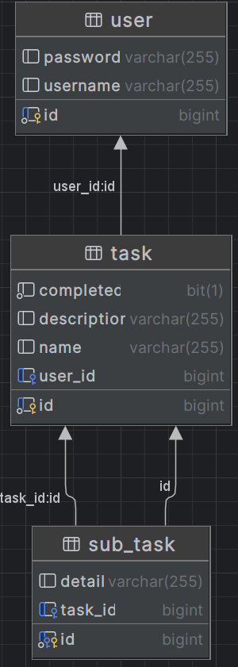

# Task Management System

## Descripción del Proyecto

- Task Management System es una aplicación backend desarrollada con ***Java y Spring Boot*** que permite la gestión de tareas, subtareas y usuarios, proporcionando funcionalidades **CRUD** completas y autenticación segura con **JWT**. 
- Esta aplicación es ideal para administrar tareas de usuario de manera estructurada, permitiendo la creación de tareas anidadas y una relación de **usuario-tareas**.

# Diagrama de Clases

# Tecnologías Utilizadas

- **Java**
- **Spring Boot**
- **Spring Security** con JWT para autenticación
- **JPA e Hibernate**
- **MySQL** para la persistencia de datos
- **Postman**

# Estructura de Controladores y Rutas

- **AuthController:** Maneja la autenticación de usuarios.
- **POST /auth/login:** Autentica al usuario y retorna un token JWT.
- **TaskController:** Gestiona las operaciones CRUD para las tareas.
- **GET /tasks:** Lista todas las tareas.
- **POST /tasks:** Crea una nueva tarea.
- **PUT /tasks/{id}:** Actualiza una tarea existente.
- **DELETE /tasks/{id}:** Elimina una tarea.

# Configuración

- Configurar el entorno de generador de proyectos con **Spring Boot**.
- **Java 21**
- Integrar las dependencia de **Spring Security, Spring Data JPA, Spring Web, MySQL Driver**

# Trabajo a futuro

- Se integrarán validaciones de contraseña, email y autenticación.

